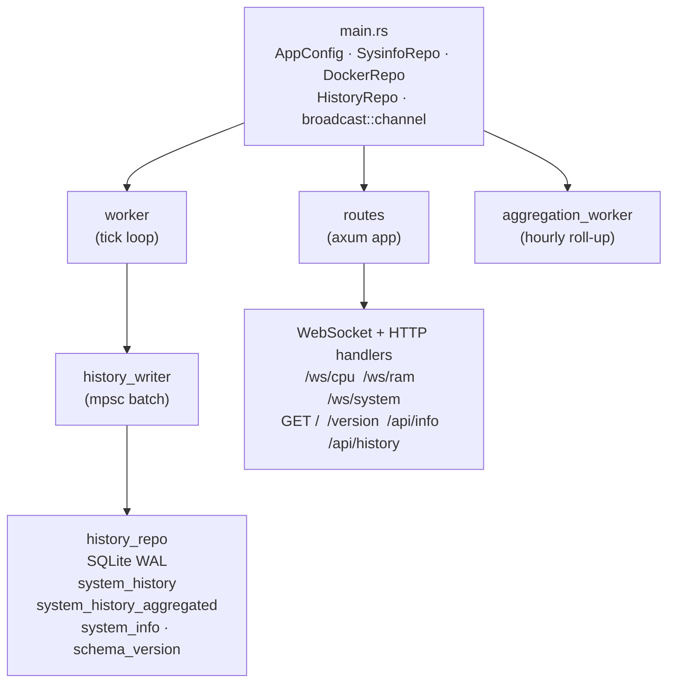
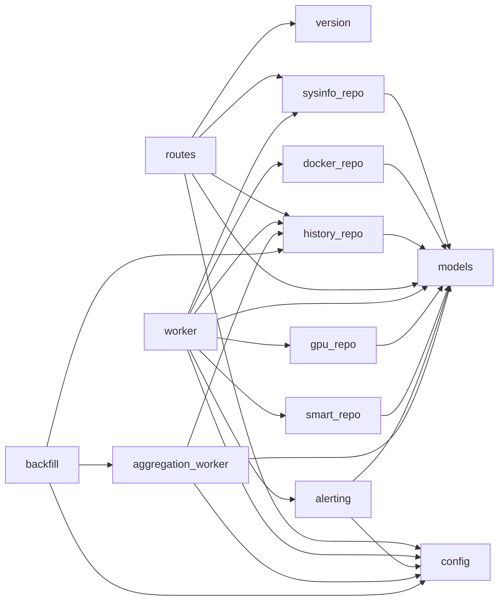
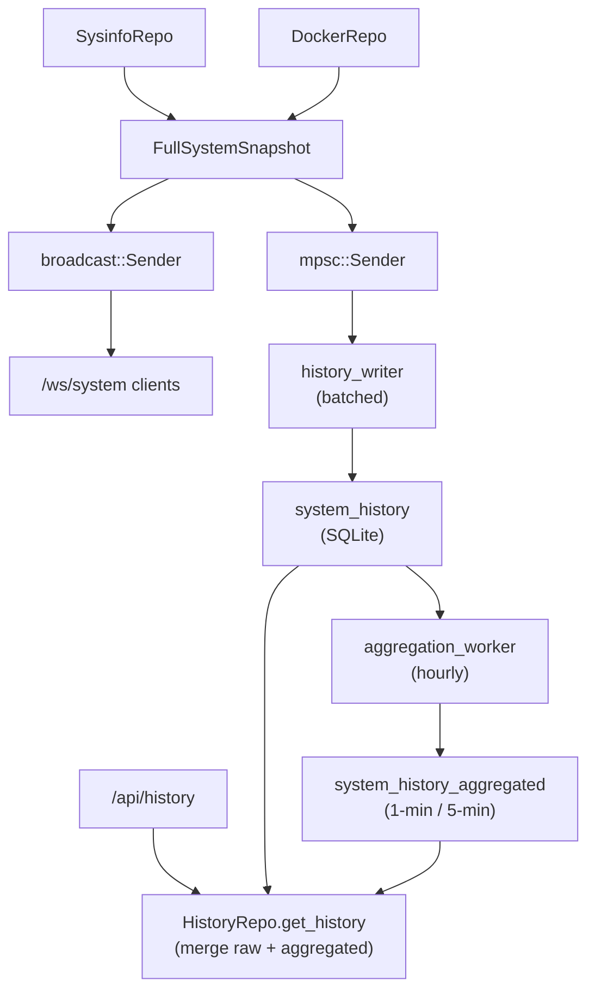

# Codebase Guide — homeserver-rust

> Version 0.8.0 · Rust 2024 edition · MSRV 1.95

A Linux system-monitoring agent that streams CPU, RAM, disk, network, and Docker container metrics over WebSockets and a small HTTP API, backed by a local SQLite database with tiered retention.

---

## Table of Contents

1. [High-Level Architecture](#high-level-architecture)
2. [Module Map](#module-map)
3. [Domain Models (`src/models/`)](#domain-models-srcmodels)
4. [Configuration (`src/config.rs`)](#configuration-srcconfigrs)
5. [System Collector (`src/sysinfo_repo/`)](#system-collector-srcsysinfo_repo)
6. [Docker Collector (`src/docker_repo/`)](#docker-collector-srcdocker_repo)
7. [History Database (`src/history_repo/`)](#history-database-srchistory_repo)
8. [Worker Tasks (`src/worker/`, `src/aggregation_worker.rs`, `src/backfill.rs`)](#worker-tasks)
9. [HTTP and WebSocket Routes (`src/routes/`)](#http-and-websocket-routes-srcroutes)
10. [Entry Point (`src/main.rs`)](#entry-point-srcmainrs)
11. [Startup and Shutdown Sequence](#startup-and-shutdown-sequence)
12. [Data Flow](#data-flow)
13. [Database Schema](#database-schema)
14. [Key Dependencies](#key-dependencies)
15. [Tests](#tests)
16. [CI / CD Workflows](#ci--cd-workflows)
17. [Configuration Reference](#configuration-reference)

---

## High-Level Architecture



The main sampling loop runs in `worker::spawn`, which calls both `sysinfo_repo` (CPU / RAM / storage / network / system stats via `sysinfo` + Linux `/proc` & `/sys` reads) and `docker_repo` (streaming Docker stats via `bollard`). Completed snapshots are broadcast on a `tokio::sync::broadcast` channel to the `/ws/system` handler and queued on an `mpsc` channel to `history_writer`, which batches them to SQLite.

---

## Module Map

```
src/
├── main.rs                     # Binary entry point, wires everything
├── lib.rs                      # Re-exports all public modules for tests
├── version.rs                  # VERSION / NAME constants from Cargo.toml
├── config.rs                   # AppConfig + sub-structs, TOML parsing + validation
├── backfill.rs                 # One-shot aggregation pass at startup
├── aggregation_worker.rs       # Hourly raw→1-min→5-min roll-up background task
│
├── models/
│   ├── mod.rs                  # Re-exports all public model types
│   ├── aggregation.rs          # AggregatedSnapshot
│   ├── container.rs            # ContainerState, ContainerStats
│   ├── network.rs              # InterfaceStat, NetworkStats
│   ├── storage.rs              # PartitionStat, DiskDeviceStat, StorageStats
│   ├── gpu.rs                  # GpuStats
│   ├── smart.rs                # SmartHealth
│   └── system.rs               # CpuStats, RamStats, SystemInfo, SystemStatsDynamic,
│                               #   SystemStats, FullSystemSnapshot, FullSystemSnapshotDisplay
│
├── sysinfo_repo/
│   ├── mod.rs                  # SysinfoRepo struct; get_cpu_stats, get_ram_stats
│   ├── collectors.rs           # Impl block: get_storage_stats, get_network_stats,
│   │                           #   get_system_info, get_system_stats
│   └── linux/
│       ├── mod.rs              # /proc and /sys helpers: loadavg, CPU temp, operstate,
│       │                       #   interface speed, CPU model, OS/DMI info
│       └── disk.rs             # DiskIoRaw, parse_diskstats, disk_sysfs_base_device_name,
│                               #   read_disk_model_linux
│
├── docker_repo/
│   ├── mod.rs                  # DockerRepo struct; container lifecycle management,
│   │                           #   live_stats cache, per-container streaming tasks
│   └── stats.rs                # process_statistics — raw bollard → ContainerStats
│
├── gpu_repo/
│   ├── mod.rs                  # GpuRepo::collect — merges backends
│   ├── sysfs.rs                # AMD/Intel via /sys/class/drm + hwmon (pure parsers)
│   └── nvidia.rs               # NVIDIA via NVML (feature `gpu-nvidia`)
│
├── smart_repo/
│   ├── mod.rs                  # SmartRepo: slow smartctl poll + cache
│   └── parse.rs                # parse_smartctl_json / parse_scan_devices (pure)
│
├── alerting/
│   ├── mod.rs                  # AlertEngine (fire/resolve/cooldown state machine), AlertEvent
│   ├── metrics.rs              # extract_metric / compare (pure)
│   └── notify.rs               # Notifier: tracing log + optional webhook POST (reqwest)
│
├── history_repo/
│   ├── mod.rs                  # HistoryRepo struct (SqlitePool + retention_ms)
│   ├── schema.rs               # connect, init, schema version migration, DDL
│   ├── raw.rs                  # save_snapshots, get_recent_snapshots,
│   │                           #   get_raw_snapshots_by_time_range, prune_old_data, …
│   ├── agg_store.rs            # save_aggregated_snapshot, get_aggregated_snapshots_by_time_range,
│   │                           #   delete_aggregated_range, prune_aggregated_old_data, …
│   ├── aggregation.rs          # Pure aggregation logic + DDL for aggregated table
│   ├── history_merge.rs        # get_history (merge raw+agg), vacuum, downsample, helpers
│   └── blob.rs                 # BLOB_VERSION / BLOB_VERSION_SYSTEM_DYNAMIC, versioned prefix helpers
│
├── routes/
│   ├── mod.rs                  # AppState, axum Router wiring
│   ├── http.rs                 # GET / /version /api/info /api/history handlers
│   └── ws.rs                   # WS /ws/cpu /ws/ram /ws/system handlers
│
└── worker/
    ├── mod.rs                  # WorkerDeps, WorkerConfig, HistoryWriterConfig, spawn
    └── history_writer.rs       # spawn_history_writer — batched flush to HistoryRepo
```

### Module Dependency Graph



---

## Domain Models (`src/models/`)

All model types derive `serde::{Serialize, Deserialize}` (for JSON API) and `wincode::{SchemaRead, SchemaWrite}` (for binary DB BLOBs). All JSON field names use `camelCase`.

### Core Snapshot Types

| Type | Fields | Purpose |
|---|---|---|
| `FullSystemSnapshot` | `timestamp`, `cpu`, `ram`, `containers`, `storage`, `network`, `system`, `gpus`, `smart` | Single raw sample; broadcast on WS and persisted to DB |
| `GpuStats` | `index`, `vendor`, `name`, `utilization_percent`, `memory_used/total_bytes`, `temperature_c`, `power_watts?`, `fan_percent?` | One GPU (NVIDIA via NVML feature; AMD/Intel via /sys) |
| `SmartHealth` | `device`, `model`, `health_passed`, `temperature_c?`, `power_on_hours?`, `reallocated_sectors?`, `wear_level_percent?` | One disk's SMART status (via `smartctl --json`) |
| `AggregatedSnapshot` | `created_at`, `resolution_seconds`, `cpu_load_{avg,min,max}`, `memory_used_{avg,min,max}`, `cpu`, `ram`, `containers`, `storage`, `network`, `system` | One downsampled bucket (60 s or 300 s); `cpu`/`ram` carry full detail from the last sample |
| `FullSystemSnapshotDisplay` | Same as `FullSystemSnapshot` but `system: SystemStats` (merged static + dynamic) | Used in history display / dump_history |

### Metric Sub-types

| Type | Key Fields |
|---|---|
| `CpuStats` | `model`, `physical_cores`, `logical_cores`, `usage_percent`, `temperature`, `core_usages` |
| `RamStats` | `total`, `used`, `available`, `usage_percent`, `swap_{total,used,free}` |
| `SystemInfo` | `os_family`, `os_manufacturer`, `os_version`, `system_manufacturer`, `system_model`, `processor_name` (static, fetched once) |
| `SystemStatsDynamic` | `uptime_secs`, `process_count`, `thread_count`, `load_avg_{1,5,15}` (dynamic, sent every tick) |
| `SystemStats` | Flattened merge of `SystemInfo` + `SystemStatsDynamic` (legacy / display path) |
| `ContainerStats` | CPU %, memory bytes, network I/O, block I/O, pids, throttling info |
| `ContainerState` | `Running \| Exited \| Paused \| Restarting \| Unknown` |
| `StorageStats` | `partitions: Vec<PartitionStat>`, `disks: Vec<DiskDeviceStat>` |
| `NetworkStats` | `interfaces: Vec<InterfaceStat>` |

`merge_system_info(info, dynamic)` merges a `SystemInfo` + `SystemStatsDynamic` into a `SystemStats` for API responses.

---

## Configuration (`src/config.rs`)

Config is loaded from a TOML file at the path given by the `CONFIG_FILE` env var (default `config.toml`). `AppConfig::load()` calls `AppConfig::load_from_str()` which parses then validates.

### Top-level Sections

| Section | Struct | Key Fields |
|---|---|---|
| `[server]` | `ServerConfig` | `port: u16`, `host: String` |
| `[database]` | `DatabaseConfig` | see below |
| `[publishing]` | `PublishingConfig` | `cpu_stats_frequency_ms`, `ram_stats_frequency_ms`, `broadcast_capacity` |
| `[monitoring]` | `MonitoringConfig` | `sample_interval_ms`, `stats_log_interval_secs`, `collect_gpu`, `collect_smart`, `smart_poll_interval_secs` |
| `[alerts]` | `AlertsConfig` | `webhook_url`, `rules: Vec<AlertRule>` (`[[alerts.rules]]`) |

### `[database]` Fields and Defaults

| Field | Default | Meaning |
|---|---|---|
| `path` | (required) | SQLite file path |
| `max_pool_size` | (required) | SQLite connection pool size |
| `flush_rate` | (required) | Flush to DB every N snapshots |
| `flush_interval_secs` | 30 | Flush at least every N seconds |
| `retention_days` | 3 | Delete history older than N days |
| `prune_interval_secs` | 3600 | How often the worker prunes |
| `enable_aggregation` | true | Enable roll-up worker |
| `aggregation_interval_secs` | 3600 | Roll-up tick interval |
| `raw_retention_hours` | 1 | Keep raw 1s data for N hours |
| `minute_retention_hours` | 24 | Keep 1-min data for N hours |
| `vacuum_schedule` | None | Cron expression for VACUUM (local time, 5-field) |
| `vacuum_interval_secs` | 86400 | Fallback VACUUM interval if no cron |

`normalize_cron_expression` converts 5-field cron to 6-field (prepends `0` for seconds) before parsing with the `cron` crate.

---

## System Collector (`src/sysinfo_repo/`)

### `SysinfoRepo`

Wraps `sysinfo::{System, Disks, Networks}` behind `Arc<Mutex<…>>` so heavy blocking reads can be offloaded with `tokio::task::spawn_blocking`.

| Method | What it reads |
|---|---|
| `get_cpu_stats()` | `sysinfo` global CPU usage (respects `MINIMUM_CPU_UPDATE_INTERVAL` to avoid stale reads), per-core usages, `/proc/cpuinfo` model name, `/sys/class/hwmon` temperature |
| `get_ram_stats()` | `sysinfo` memory/swap |
| `get_storage_stats()` | `sysinfo` disk list for partitions; `/proc/diskstats` for I/O counters; `/sys/block/<dev>/device/model` for model names |
| `get_network_stats()` | `sysinfo` network counters; `/sys/class/net/<iface>/speed` for link speed; `/sys/class/net/<iface>/operstate`; computes rate (bytes/s) by diff against cached previous sample |
| `get_system_info()` | `/etc/os-release` (PRETTY_NAME), `/sys/class/dmi/id/sys_vendor` (hardware vendor), hostname |
| `get_system_stats()` | `/proc/loadavg`, process + thread counts from `sysinfo` |

### `sysinfo_repo::linux`

Provides pure parsing functions with public visibility (used in unit tests):

- `parse_loadavg(content)` — parses `/proc/loadavg` text
- `parse_hwmon_temp(content)` — millidegrees to °C
- `parse_operstate(content)` — maps operstate string to `bool`
- `parse_diskstats(content)` — returns `HashMap<String, DiskIoRaw>`
- `disk_sysfs_base_device_name(name)` — strips partition suffix for NVMe / MMC / sd\* devices

Network rate calculation skips an interface tick if a cumulative counter decreases (counter reset / driver quirk), incrementing `NETWORK_RATE_COUNTER_DECREASE_SKIPS` and logging at debug.

---

## Docker Collector (`src/docker_repo/`)

### `DockerRepo`

Connects to the Docker daemon via `Docker::connect_with_unix_defaults()` (Unix socket).

**Streaming model:** each running container gets one long-lived `tokio::spawn` task that reads from `docker.stats(&id, stream: true)`. Stats are written into a shared `Arc<RwLock<HashMap<String, ContainerStats>>>` (`live_stats`). The worker calls `list_running_and_refresh_stats()` every tick, which:

1. Lists currently running containers from the Docker API.
2. Diffs against `active_streams` — starts monitoring new containers, aborts handles for stopped ones.
3. Returns the current contents of `live_stats`.

`stats::process_statistics(response, id, name)` extracts CPU delta (total − system), kernel/user splits, memory usage/limit/max, aggregated network RX/TX/packets/errors/dropped, block I/O bytes and ops, PIDs, and CPU throttling data from a `bollard::models::ContainerStatsResponse`.

---

## History Database (`src/history_repo/`)

### `HistoryRepo`

Thin wrapper around an `sqlx::SqlitePool`. WAL journal mode, 5-second busy timeout, Normal synchronous mode.

`CURRENT_SCHEMA_VERSION = 5`. On `init()`, `ensure_schema_version()` handles these cases:
- No schema row + no legacy tables → fresh install, write current version.
- No schema row + legacy tables present → drop and recreate (data purge with a warning).
- Older version (`found < current`) → run ordered, additive, data-preserving migrations
  (`run_migrations`); a step with no registered migration falls back to a purge.
- Newer/unknown version (downgrade) → drop and recreate (data purge with a warning).

Migrations are declared in `schema.rs::MIGRATIONS` as `(from_version, &[sql])` and applied in
their own transactions. `v2 → v3` adds nullable `cpu_data` / `ram_data` BLOB columns so full
CPU/RAM detail is persisted; `v3 → v4` adds a nullable `gpu_data` BLOB for GPU metrics; `v4 → v5`
adds a nullable `smart_data` BLOB for SMART disk health. Rows written before a column existed keep
`NULL` and are read via a scalar/empty fallback.

### Tables

| Table | Purpose |
|---|---|
| `schema_version` | Single row `(key='schema', value=5)` |
| `system_info` | Single row (id=1): wincode-serialised `SystemInfo` (overwritten on each flush) |
| `system_history` | Raw 1-second snapshots |
| `system_history_aggregated` | Downsampled snapshots at 60 s or 300 s resolution |

### Blob Encoding

Binary fields are prefixed with a version byte (`blob.rs`):
- `BLOB_VERSION = 1` — containers, storage, network, `cpu_data`, `ram_data`, `gpu_data`, `smart_data` blobs; also legacy system blob
- `BLOB_VERSION_SYSTEM_DYNAMIC = 2` — `SystemStatsDynamic` blobs

`blob_payload(bytes, expected_version)` strips the prefix byte when it matches, or returns the full slice (legacy path). On deserialization failure, functions return safe empty defaults and log at debug.

### Key `HistoryRepo` Methods

| Method | Module | Description |
|---|---|---|
| `connect(path, retention_days)` | schema | Create pool, set `retention_ms` |
| `init()` | schema | Schema migration + DDL |
| `save_snapshots(snapshots, system_info)` | raw | Batch insert raw rows + upsert system_info |
| `get_recent_snapshots(limit)` | raw | Latest N raw rows (for WS welcome / admin) |
| `get_raw_snapshots_by_time_range(from, to)` | raw | Ascending raw rows for aggregation |
| `get_min_raw_created_at_before(cutoff)` | raw | Aggregation lower bound |
| `delete_raw_range(from, to)` | raw | Delete after aggregation |
| `prune_old_data()` | raw | Delete rows older than `retention_ms` |
| `save_aggregated_snapshot(agg)` | agg_store | Insert one aggregated bucket |
| `get_aggregated_snapshots_by_time_range(from, to, res)` | agg_store | Read aggregated rows for API |
| `get_min_aggregated_created_at_before(cutoff, res)` | agg_store | 1-min→5-min aggregation bound |
| `delete_aggregated_range(from, to, res)` | agg_store | Delete after 5-min roll-up |
| `prune_aggregated_old_data()` | agg_store | Delete agg rows older than `retention_ms` |
| `get_history(from, to, resolution_secs, raw_cutoff_ts)` | history_merge | Merge raw + aggregated by time range |
| `vacuum()` | history_merge | `PRAGMA VACUUM` |

### Aggregation Logic (`history_repo::aggregation`)

`aggregate_snapshots(snapshots, bucket_start, resolution)` produces one `AggregatedSnapshot` from a slice of `FullSystemSnapshot`:
- CPU: avg/min/max of `usage_percent`
- Memory: avg/min/max of `ram.used`
- Containers: grouped by id; CPU % and memory averaged; network/block bytes summed; state/pids/throttling from last sample
- CPU / RAM (full structs) / storage / network / system: taken from the last snapshot in the bucket

`aggregate_aggregated_snapshots` does the same for 1-min → 5-min roll-up.

`get_history` in `history_merge` merges the two tiers:
- Timestamps `>= raw_cutoff_ts` → raw table (optionally downsampled by `downsample_snapshots`)
- Timestamps `< raw_cutoff_ts` → aggregated table at 60 s or 300 s resolution

---

## Worker Tasks

### Main Worker (`src/worker/mod.rs`)

`worker::spawn(deps, config)` runs a `tokio::spawn` loop that ticks every `sample_interval_ms`. Each tick:

1. Calls `sysinfo_repo.get_{cpu,ram,storage,network,system}_stats()`.
2. Calls `docker_repo.list_running_and_refresh_stats()`.
3. Constructs a `FullSystemSnapshot`.
4. Broadcasts it on `broadcast::Sender<FullSystemSnapshot>` (for `/ws/system`).
5. Sends it on `mpsc::Sender<FullSystemSnapshot>` (for `history_writer`).

Secondary timers on the same `tokio::select!`:
- `stats_log_tick` — logs WS client count, snapshots saved, snapshots pruned at `stats_log_interval_secs`.
- `prune_tick` — calls `history_repo.prune_old_data()` every `prune_interval_secs`.
- `shutdown_rx` — `oneshot::Receiver<()>` for graceful shutdown.

### History Writer (`src/worker/history_writer.rs`)

`spawn_history_writer(write_rx, history_repo, system_info, config, snapshots_saved_total)` runs a dedicated task that buffers snapshots and flushes via `history_repo.save_snapshots()`:
- Flush when `buffer.len() >= flush_rate`
- Flush when `flush_interval_secs` timer fires (prevents stale data on low-traffic systems)
- Final flush when the channel closes (sender dropped on worker shutdown)

### Aggregation Worker (`src/aggregation_worker.rs`)

`aggregation_worker::spawn(repo, config, shutdown_rx)` runs hourly (configurable via `aggregation_interval_secs`):

1. **raw → 1-min**: For each 1-minute bucket with `created_at < now - raw_retention_hours`, aggregate raw rows and delete them.
2. **1-min → 5-min**: For each 5-minute bucket with `created_at < now - minute_retention_hours`, aggregate 1-min rows and delete them.
3. Prune raw and aggregated rows older than `retention_days`.

VACUUM is managed by an internal `vacuum_scheduler` sub-task that fires either on a cron schedule (`vacuum_schedule`) or a fixed interval (`vacuum_interval_secs`).

### Backfill (`src/backfill.rs`)

`backfill::run_backfill(repo, config)` runs `aggregation_worker::run_one_tick` once at startup before the main worker begins, so any data left over from a previous run is rolled up immediately.

---

## HTTP and WebSocket Routes (`src/routes/`)

### `AppState`

Shared state injected into every handler via Axum's `State` extractor:

```
stats_tx:              broadcast::Sender<FullSystemSnapshot>
sysinfo_repo:          Arc<SysinfoRepo>
system_info:           Arc<SystemInfo>
ws_system_connections: Arc<AtomicUsize>
config:                AppConfig
history_repo:          Arc<HistoryRepo>
```

### HTTP Endpoints

| Route | Handler | Response |
|---|---|---|
| GET / | inline | "Hello from Rust homeserver!" (plain text) |
| `GET /health` | `health_handler` | `200 "ok"` when the SQLite pool is reachable (cheap `SELECT 1`), else `503` |
| `GET /version` | `version_handler` | `{"name": "homeserver", "version": "0.8.0"}` |
| `GET /api/info` | `api_info_handler` | `SystemInfo` as JSON |
| `GET /api/history` | `api_history_handler` | `Vec<FullSystemSnapshot>` merged from raw + aggregated |

`/api/history` query params: `from` (ms epoch), `to` (ms epoch), `resolution` (`"1s"`, `"30s"`, `"1m"`, `"5m"`, or numeric seconds). Default: last 1 hour at 60-second resolution.

### WebSocket Endpoints

| Route | Handler | Interval |
|---|---|---|
| `WS /ws/cpu` | `ws_cpu` → `stream_cpu` | `cpu_stats_frequency_ms` |
| `WS /ws/ram` | `ws_ram` → `stream_ram` | `ram_stats_frequency_ms` |
| `WS /ws/system` | `ws_system` → `stream_system` | driven by broadcast channel |

WebSocket transport is `yawc` (not axum's native WS), so connections negotiate
`permessage-deflate` (RFC 7692) compression. Each handler accepts a `yawc::IncomingUpgrade`
extractor, completes the upgrade with balanced compression enabled, then splits the socket into
a sink (sends stats/pings) and a stream (polled so client `Close` frames end the loop and pongs
are drained). All WS handlers send periodic pings every 30 seconds (`WS_PING_INTERVAL`) and
enforce a 10-second send timeout (`WS_SEND_TIMEOUT`).

`/ws/system` sends a welcome message `{"type": "info", "systemInfo": {...}}` on connect, then re-broadcasts every `FullSystemSnapshot` from the broadcast channel. The `WsSystemGuard` RAII type decrements `ws_system_connections` on disconnect. Lagged clients receive a warning log; the stream continues.

CORS is configured to allow any origin (`CorsLayer::new().allow_origin(Any)`).

---

## Entry Point (`src/main.rs`)

`main()` orchestrates startup in this order:

1. Initialise `tracing_subscriber` with local-time timestamps and `RUST_LOG` env filter.
2. Load and validate `AppConfig`.
3. Create `broadcast::channel<FullSystemSnapshot>` (capacity from config).
4. Construct `Arc<SysinfoRepo>`, call `get_system_info()` once.
5. Construct `Arc<DockerRepo>`.
6. Construct `Arc<HistoryRepo>`, call `init()`.
7. If `enable_aggregation`: run backfill, then spawn `aggregation_worker`.
8. Spawn `history_writer` task.
9. Spawn main `worker` task.
10. Build the Axum `Router` via `routes::app(…)`.
11. Bind `TcpListener` and serve with graceful shutdown on SIGTERM or Ctrl-C.
12. On shutdown signal: send to worker shutdown channel, await worker and writer handles, then send to aggregation worker shutdown channel and await it.

`jemalloc` is used as the global allocator on non-MSVC targets.

---

## Startup and Shutdown Sequence

```
main starts
  │
  ├─ load config
  ├─ build repos (sysinfo, docker, history)
  ├─ backfill aggregation (one tick, blocking startup)
  ├─ spawn aggregation_worker  ──► oneshot shutdown_rx
  ├─ spawn history_writer      ──► mpsc::Receiver closes on worker drop
  ├─ spawn worker              ──► oneshot shutdown_rx
  └─ axum::serve with graceful_shutdown future

SIGTERM / Ctrl-C received
  │
  ├─ axum serves outstanding requests then stops accepting
  ├─ send () to worker shutdown_tx
  ├─ await worker_handle
  ├─ await writer_handle (final flush)
  ├─ send () to agg shutdown_tx
  └─ await agg_handle
```

---

## Data Flow



---

## Database Schema

### `schema_version`
```sql
CREATE TABLE schema_version (
  key   TEXT PRIMARY KEY,
  value INTEGER NOT NULL
);
-- Single row: key='schema', value=5
```

### `system_history`
```sql
CREATE TABLE system_history (
  id              INTEGER PRIMARY KEY AUTOINCREMENT,
  created_at      INTEGER NOT NULL,   -- Unix epoch ms
  cpu_load        REAL    NOT NULL,   -- usage_percent
  memory_used     INTEGER NOT NULL,   -- bytes
  container_data  BLOB    NOT NULL,   -- wincode Vec<ContainerStats>
  storage_data    BLOB    NOT NULL,   -- wincode StorageStats
  network_data    BLOB    NOT NULL,   -- wincode NetworkStats
  system_data     BLOB    NOT NULL,   -- wincode SystemStatsDynamic (v2) or SystemStats (v1)
  cpu_data        BLOB,               -- wincode CpuStats (schema v3+; NULL on older rows)
  ram_data        BLOB,               -- wincode RamStats (schema v3+; NULL on older rows)
  gpu_data        BLOB,               -- wincode Vec<GpuStats> (schema v4+; NULL on older rows)
  smart_data      BLOB                -- wincode Vec<SmartHealth> (schema v5+; NULL on older rows)
);
CREATE INDEX idx_history_created_at ON system_history(created_at);
```

### `system_info`
```sql
CREATE TABLE system_info (
  id    INTEGER PRIMARY KEY CHECK (id = 1),
  data  BLOB NOT NULL   -- wincode SystemInfo; upserted on each batch flush
);
```

### `system_history_aggregated`
```sql
CREATE TABLE system_history_aggregated (
  id                 INTEGER PRIMARY KEY AUTOINCREMENT,
  created_at         INTEGER NOT NULL,   -- bucket start time, Unix epoch ms
  resolution_seconds INTEGER NOT NULL,   -- 60 or 300
  cpu_load_avg       REAL    NOT NULL,
  cpu_load_min       REAL,
  cpu_load_max       REAL,
  memory_used_avg    INTEGER NOT NULL,
  memory_used_min    INTEGER,
  memory_used_max    INTEGER,
  container_data     BLOB    NOT NULL,
  storage_data       BLOB    NOT NULL,
  network_data       BLOB    NOT NULL,
  system_data        BLOB    NOT NULL,
  cpu_data           BLOB,            -- wincode CpuStats (schema v3+; NULL on older rows)
  ram_data           BLOB,            -- wincode RamStats (schema v3+; NULL on older rows)
  gpu_data           BLOB,            -- wincode Vec<GpuStats> (schema v4+; NULL on older rows)
  smart_data         BLOB             -- wincode Vec<SmartHealth> (schema v5+; NULL on older rows)
);
CREATE INDEX idx_aggregated_created_at_resolution
  ON system_history_aggregated(created_at, resolution_seconds);
```

---

## Key Dependencies

| Crate | Version | Role |
|---|---|---|
| `tokio` | 1 | Async runtime (full features) |
| `axum` | 0.8 | HTTP server (JSON); routing |
| `yawc` | 0.3 | WebSocket transport with `permessage-deflate` compression |
| `tower-http` | 0.7 | CORS middleware |
| `serde` / `serde_json` | 1 | JSON serialisation for API |
| `wincode` | 0.5 | Binary serialisation for SQLite BLOBs |
| `toml` | 1 | Config file parsing |
| `sysinfo` | 0.39 | CPU, RAM, disk, network, process stats |
| `bollard` | 0.21 | Docker daemon API (Unix socket) |
| `sqlx` | 0.9 | Async SQLite (WAL, pooling) |
| `tracing` / `tracing-subscriber` | 0.1 / 0.3 | Structured logging |
| `chrono` | 0.4 | Local-time timestamps in logs |
| `cron` | 0.17 | VACUUM schedule parsing |
| `bytes` | 1 | WS ping frames |
| `anyhow` | 1 | Error propagation |
| `tikv-jemallocator` | 0.7 | jemalloc global allocator (non-MSVC) |
| `nvml-wrapper` | 0.10 | NVIDIA GPU metrics via NVML — optional, enabled by the `gpu-nvidia` feature |
| `reqwest` | 0.13 | Alert webhook HTTPS POST (rustls TLS + webpki-roots; no OpenSSL) |
| `futures-util` | 0.3 | `StreamExt` for Docker stats stream |

Dev dependencies: `tokio` (rt+macros), `tempfile`, `axum-test` (WS integration tests).

---

## Tests

Test files live under `tests/` and include:

| File | Coverage |
|---|---|
| `config_tests.rs` | Config parsing, validation edge cases |
| `aggregation_tests.rs` | Aggregation math, bucket boundaries |
| `history_repo_tests.rs` | Raw save/load/prune round-trips (tempfile DB) |
| `history_repo_aggregation_tests.rs` | Aggregated table CRUD |
| `docker_repo_tests.rs` | DockerRepo construction / error paths |
| `docker_stats_tests.rs` | `process_statistics` with synthetic bollard responses |
| `linux_parser_tests.rs` | `parse_loadavg`, `parse_hwmon_temp`, `parse_diskstats`, `disk_sysfs_base_device_name` |
| `models_serde_tests.rs` | JSON round-trip for all model types |
| `models_wincode_tests.rs` | wincode round-trip for all model types |
| `integration_tests.rs` | End-to-end HTTP routes via `axum-test` |
| `worker_tests.rs` | Worker spawn / shutdown behaviour |

`tests/common/` contains shared test helpers.

---

## CI / CD Workflows

### `.github/workflows/ci.yml`
Runs on every push/PR to `main`:
1. `cargo fmt --check`
2. `cargo clippy --all-targets --all-features -- -D warnings`
3. `cargo test --all-features`
4. `cargo build --release`
5. `cargo audit` (via the `rustsec/audit-check` action): scans `Cargo.lock` for known RustSec advisories.

### `.github/workflows/tag-version.yml`
Runs after CI succeeds on `main`:
1. Extracts version from `Cargo.toml`.
2. Creates or force-pushes a `v<version>` git tag (no Docker build).

### `.github/workflows/docker.yml`
Triggered by `v*.*.*` tag pushes:
1. Builds and pushes a multi-arch Docker image to GHCR with semver tags (`major.minor.patch`, `major.minor`, `major`, `latest`). Targets `linux/amd64` and `linux/arm64` (arm64 via QEMU emulation, for Raspberry Pi / ARM SBC homeservers).

### `.github/workflows/docs.yml`
Runs on every push to `main`:
1. Builds rustdoc documentation.
2. Generates CHANGELOG via git-cliff.
3. Deploys to the `gh-pages` branch, served via GitHub Pages.

### `.github/workflows/release.yml`
Triggered by `v*.*.*` tag pushes:
1. Generates release notes with git-cliff.
2. Builds and strips the `linux/amd64` binary.
3. Creates a GitHub Release with the release notes and binary attached.

---

## Configuration Reference

Default `config.toml`:

```toml
[server]
port = 8081
host = "0.0.0.0"

[database]
path = "data/server.db"
max_pool_size = 10
flush_rate = 10
flush_interval_secs = 30
retention_days = 3
prune_interval_secs = 3600
enable_aggregation = true
aggregation_interval_secs = 3600
raw_retention_hours = 1
minute_retention_hours = 24
vacuum_schedule = "0 3 * * *"   # 03:00 daily local time; omit to use vacuum_interval_secs
vacuum_interval_secs = 86400
persist_gpu = true                # persist GPU metrics to history (live WS always includes them)
persist_smart = true              # persist SMART disk health to history (live WS always includes it)

[publishing]
cpu_stats_frequency_ms = 1000
ram_stats_frequency_ms = 1000
broadcast_capacity = 60

[monitoring]
sample_interval_ms = 1000
stats_log_interval_secs = 60
collect_gpu = true                # collect GPU metrics each tick (NVIDIA needs --features gpu-nvidia)
collect_smart = false             # collect SMART disk health (needs smartctl + device privileges)
smart_poll_interval_secs = 900    # how often to refresh SMART (slow/privileged)

[alerts]
# webhook_url = "https://example.com/hook"   # optional; omit to log-only
# [[alerts.rules]]
# name = "cpu hot"
# metric = "cpu_temperature"   # cpu_usage|mem_usage_percent|swap_usage_percent|load_avg_1|
#                              # cpu_temperature|disk_usage_percent|gpu_temperature|gpu_utilization
# op = ">"                     # > >= < <=
# threshold = 85.0
# duration_secs = 30           # sustained breach before firing (default 0)
# cooldown_secs = 300          # min seconds between repeat notifications (default 300)
```

`CONFIG_FILE` environment variable overrides the config file path.
